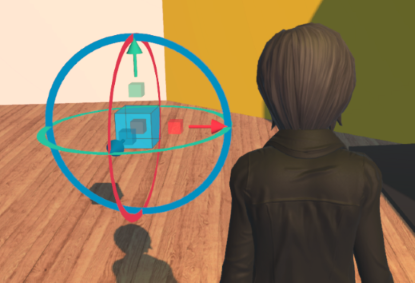

# Define Interactions with Avatars

When your avatar comes in contact with an entity, you can control its interactions with the entity using simple scripts. 

An interaction between an avatar and an entity occurs when the avatar comes in contact with an entity's bounding box. The bounding box (or bounds) is the frame that is around the outside of the entity. In the case of a cube, the bounds are the exact size and shape as the entity. However, in the case of more complex objects, the bounds might be larger than the actual mesh model.  

There are two methods you can use to script these interactions. [`Entities.enterEntity()`](https://apidocs.highfidelity.com/Entities.html#.enterEntity) occurs when the avatar contacts the bounding box, not the model itself. Similarly, [`Entities.leaveEntity()`](https://apidocs.highfidelity.com/Entities.html#.leaveEntity) occurs when the avatar exits the bounding box.

## Tutorial: Enter a Box to Change Its Color

The following example walks you through the process of creating a simple entity, and scripting an interaction between the entity and your avatar. When your avatar comes in contact with the box, the box will change color. When your avatar moves away, the box will return to its original color. 

1. [Create a cube entity](create-entities.html).  
2. The following script changes the color of the cube as you approach (yellow) or leave (pink) its bounding box. Save it to a file called `interactions-example.js`.
    ```javascript
    (function(){
        this.enterEntity = function(entityID) {
            Entities.editEntity(entityID, {
                color: { red: 255, green: 64, blue: 64 },
            });
        };
        this.leaveEntity = function(entityID) {
            Entities.editEntity(entityID, { 
                color: { red: 255, green: 190, blue: 20}
            });
        };
    });
    ```
3. In the **Create** app, click on 'Properties' and scroll down to the 'Script' settings. Enter the path and file name to `interactions-example.js` that you created above. Press 'Enter'. 

A full range of entity parameters are controllable with these functions. Entities can be used as invisible sensors or expanded to cover an entire building with the functions running while you are inside, and stop when you walk out.

**See Also**

+ [Define an Entity's Behavior](entity-behavior.html)
+ [Interact with Your Environment](../../explore/interact.html)
+ [API Reference: Entities](https://apidocs.highfidelity.com/Entities.html)
+ [Get Started with Scripting](../../script/get-started-with-scripting.html)