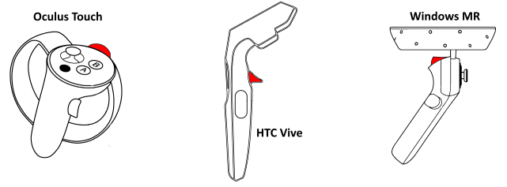

# Interact with Your Environment

In High Fidelity, your experiences are shaped the world around you. When you enter a domain, all of the space around you is built with [entities](../create/entities), or the building blocks of your environments. The walls of your room, the tree in the distance, or the animated butterfly that flew past are all entities. 

Just like in the real world, you can interact with your environment by grabbing items or colliding with objects. 

**On This Page:**

* [Grab Objects](#grab-objects)
* [Collisions](#collisions)
* [Triggered Entities](#triggered-entities)

## Grab Objects

You can grab objects in High Fidelity using your mouse or hand controllers. You can grab an entity, hold it, throw it, and drop it depending on the [entity's properties](../create/entities/entity-behavior). 

* In Desktop mode, click and hold the left mouse button to grab and hold an entity. 
* In VR mode, reach out towards the object and press the Grab button. The location of this button depends on the controllers you are using. 

>>>>>Some entities cannot be grabbed. For example, a domain owner will not give you permission to grab and move a wall in their building. When creating your own entities, you can [set the Grabbable property](../create/entities/entity-behavior#entity-grabbing-behavior-and-triggers) to define whether or not it can be grabbed by others. 

## Collisions

You can collide (or run into) objects and other avatars in High Fidelity. Likewise, objects can collide with one another. We use [physics to govern how entities behave](../create/entities/entity-physics) when they collide with each other or with avatars. 

Without this collision property set, objects will move straight through other entities and avatars. As you interact with your environment, take note on which objects have collisions enabled based on whether or not you can walk through them. 

When creating your own entities, you can [set the Collision property](../create/entities/entity-behavior#entity-collision-behavior) to turn on or off collisions.

## Triggered Entities

Some entities have scripts (or triggers) that make them behave a certain way when you interact with it. For example, you can trigger a light switch to turn on or off when your hand passes through it, or make a pet walk when you grab its leash. 

These triggers are scripted in the entities themselves by their creators. Because of this, the possible behavior is endless. We encourage you to explore and discover all of the cool ways you can interact with your surroundings. 

**See Also**

+ [Apply Physics to Entities](../create/entities/entity-physics)
+ [Define an Entity's Behavior](../create/entities/entity-behavior)
+ [Add Sound to Entities](../create/entities/add-sounds)
+ [Define Interactions with Avatars](../create/entities/avatar-interactions)